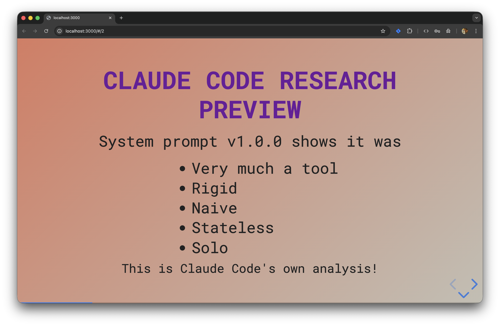

# Claude Code Meetup slides

Slides for Claude Code meetups Amsterdam

## Sessions

### [2026-02-19 — Claude Code 1 Year Old!](2026-02-19/index.html)

Presented at The Social Hub City, Amsterdam. Covers Claude Code's journey from its research preview launch to today: how it evolved from a rigid CLI tool into a principled autonomous agent, reflections on vibe coding, a Bob Ross-inspired coding agent experiment, and tips on cherishing your configuration setup.
