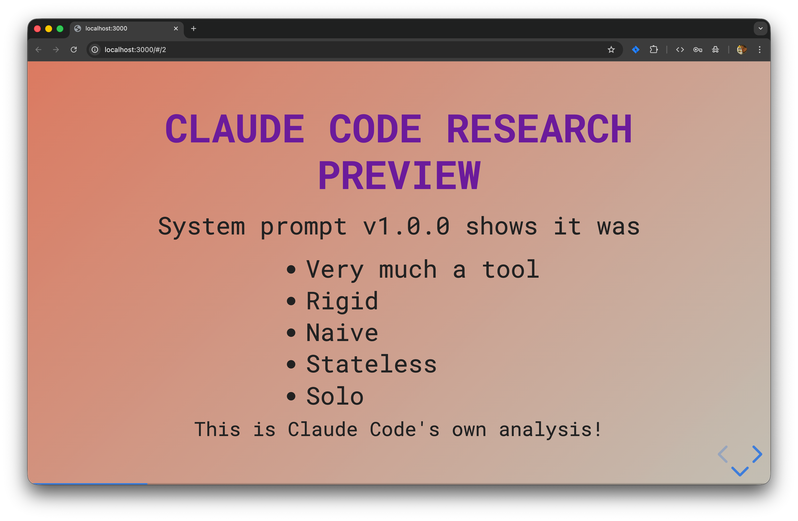
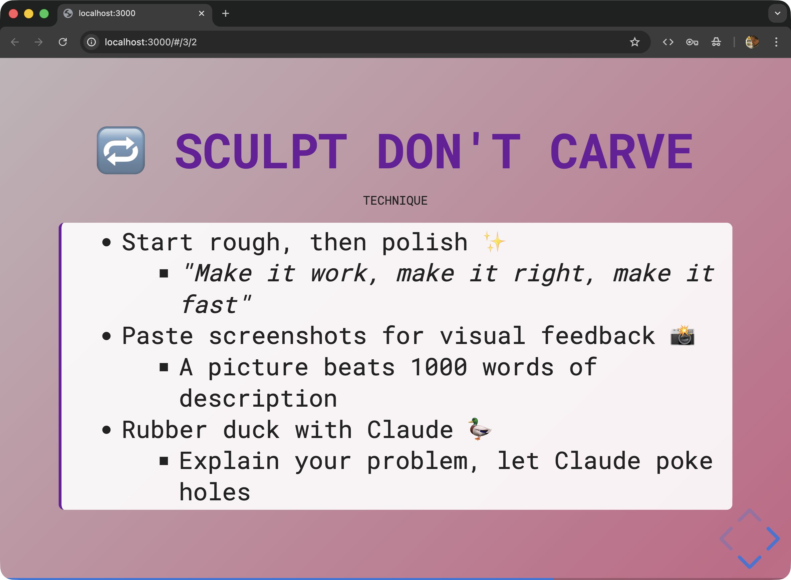
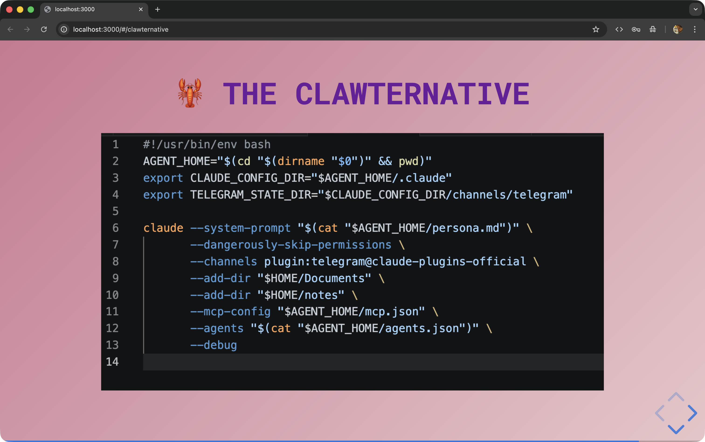

# Claude Code Meetup slides

Slides for Claude Code meetups

## Sessions

### [2026-02-19 — Claude Code 1 Year Old!](2026-02-19/index.html)

Presented at The Social Hub City, Amsterdam. Covers Claude Code's journey from its research preview launch to today: how it evolved from a rigid CLI tool into a principled autonomous agent, reflections on vibe coding, a Bob Ross-inspired coding agent experiment, and tips on cherishing your configuration setup.

### [2026-03-27 - Code /w Claude](2026-03-27/index.html)

Presented at NP3, Groningen. Covers an introduction to Claude and Claude code and a hands-on workshop to learn to build with Claude Code.

### [2026-04-03 — Skills, Agents & Channels](2026-04-03/index.html)

Presented at Amsterdam, supported by Anthropic. Covers skills (progressive disclosure, Google Programmable Search Engine, web-to-markdown), custom agents for specialist sub-tasks, and the new Claude Code channels feature as an OpenClaw alternative.