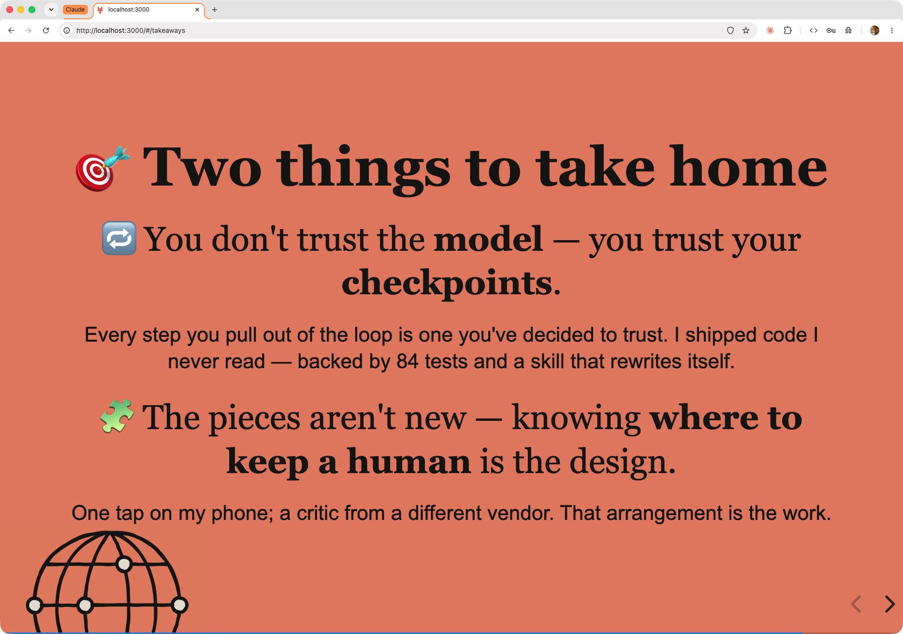
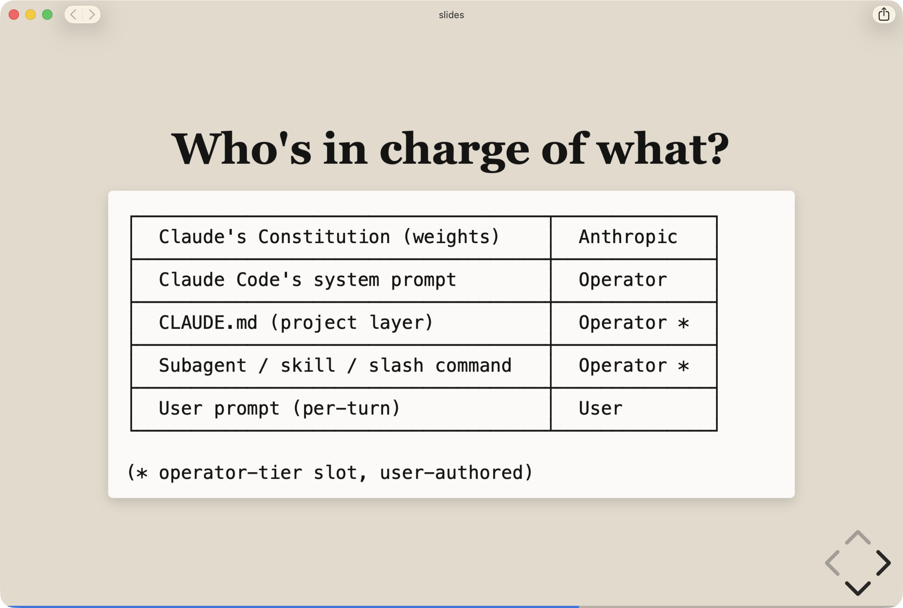
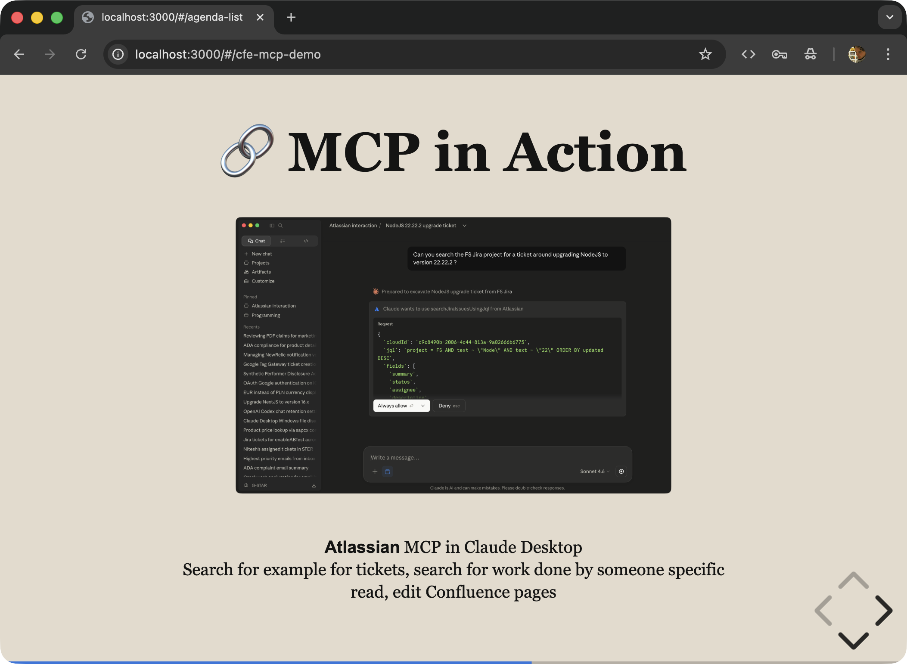

# Claude Code Meetup slides

Slides for Claude Code meetups

## Sessions

### [2026-06-18 — Community Talks · 4th Amsterdam](2026-06-18/index.html)

Presented in Amsterdam (4th edition). Community talks covering: Tribumap ([Elie Mietkiewicz](https://www.linkedin.com/in/elie-mietkiewicz/)), "How I Spent 2.5 Hours and Fired a SaaS Vendor" ([Aike Müller](https://www.linkedin.com/in/aikemueller/)), "I let Claude run my SEO" ([Anna Sheronova](https://www.linkedin.com/in/asheronova/)), vana — an autonomous art agent built on loops, a self-improving skill and a human-in-the-loop checkpoint ([Vincent Bruijn](https://www.linkedin.com/in/vincentbruijn/)), and "Every Session Is Groundhog Day For Your AI" ([Amit Prusty](https://www.linkedin.com/in/amitprusty/)).

### [2026-05-20 — Community Talks](2026-05-20/index.html)

Presented in Eindhoven. Community talks covering: shipping with Claude (ComChamp), engineering the feedback loop, practical Claude examples in engineering, Claude's Constitution, MCP in Claude Desktop, and going from idea to PRD.

### [2026-05-06 — Claude for Everyone](2026-05-06/index.html)

Presented at BetterBe, Enschede. Covers touchpoints to Anthropic's tools for a general audience: Anthropic as a frontier lab, claude.ai, the Desktop and mobile apps, Claude Code, MCP and Skills protocols, and the Cowork power tool.

### [2026-04-03 — Skills, Agents & Channels](2026-04-03/index.html)

Presented at Amsterdam, supported by Anthropic. Covers skills (progressive disclosure, Google Programmable Search Engine, web-to-markdown), custom agents for specialist sub-tasks, and the new Claude Code channels feature as an OpenClaw alternative.

### [2026-03-27 - Code /w Claude](2026-03-27/index.html)

Presented at NP3, Groningen. Covers an introduction to Claude and Claude code and a hands-on workshop to learn to build with Claude Code.

### [2026-02-19 — Claude Code 1 Year Old!](2026-02-19/index.html)

Presented at The Social Hub City, Amsterdam. Covers Claude Code's journey from its research preview launch to today: how it evolved from a rigid CLI tool into a principled autonomous agent, reflections on vibe coding, a Bob Ross-inspired coding agent experiment, and tips on cherishing your configuration setup.
